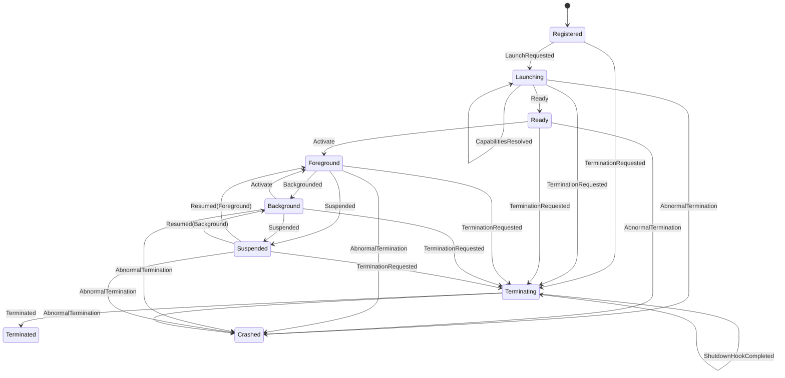

# App Lifecycle and Package Manifest Foundation

- **Workstream:** `APP-LC-01`
- **Base contract:** App SDK / App Manifest v1 in `nagi-sdk::app_contract`
- **Lifecycle extension:** `org.nagi.app-lifecycle`, schema version 1

This host-side foundation fills gaps around the existing App SDK contract. It
does not define a second base manifest, launch a process, grant capabilities,
or connect an application to the Nagi runtime. The base manifest and transition
machine remain owned by `nagi-sdk`; this workstream adds a small package
extension model and an observation adapter around those public types.

## Application identity and versions

The base manifest's `AppIdentity` is the canonical identity. Its reverse-domain
identifier is stable across display-name, locale, package location, and runtime
session changes. It maps to the existing `AppId`; neither the extension nor the
package path invents a second identity.

`AppVersion` parses standard SemVer 2.0 versions and implements deterministic
ordering, including prerelease precedence. The validated package model returns
the parsed app version. `minimumNagiVersion`, when present, is compared using
the same SemVer ordering. Service contracts use the App SDK's `ContractVersion`:
the same major version and an equal or newer minor version are compatible.

## Base manifest and lifecycle extension

App Manifest v1 already owns the required identity, app version, display name,
entrypoint, requested capabilities, localization, and persisted-state
compatibility fields. `requestedCapabilities` is interpreted as the required
capability declaration list. This extension adds optional capability requests
and required external service contracts without changing that base schema.

The extension is stored under the base manifest's namespaced `extensions`
object. The base SDK can ignore an extension it does not understand. APP-LC
readers accept only extension schema version 1, reject unknown fields within
that version, and preserve namespaced metadata without interpreting it.
Unrelated extension namespaces remain for their owners to validate.

| Extension field | Meaning |
| --- | --- |
| `schemaVersion` | Required integer; currently `1`. |
| `minimumNagiVersion` | Optional SemVer floor for the Nagi runtime. |
| `optionalCapabilities` | Optional capability IDs; these are declarations only. |
| `requiredServices` | Optional array of stable service IDs and required contract versions. |
| `metadata` | Optional namespaced opaque values preserved for publisher tooling. |

Required capability declarations stay in the base `requestedCapabilities`
array. An ID cannot also appear in `optionalCapabilities`; duplicates within
either declaration list are rejected. Service IDs are stable namespaced
identifiers, not filesystem paths. Duplicate service IDs are rejected even if
they specify different versions.

The typed base manifest supplied to `parse_app_package_manifest` must have been
parsed from the same JSON document. The host validates the base contract first,
then passes that typed contract and the same document to the APP-LC extension
parser. This keeps the extension adapter from maintaining a second base
manifest parser.

### Minimal manifest

```json
{
  "schemaVersion": 1,
  "sdkContractVersion": { "major": 1, "minor": 0 },
  "id": "com.example.hello",
  "version": "1.0.0",
  "origin": "third-party",
  "displayName": { "en-US": "Hello" },
  "supportedLocales": ["en-US"],
  "entrypoint": { "kind": "native", "target": "bin/hello.napp" },
  "resources": [],
  "intents": [],
  "requestedCapabilities": [],
  "stateCompatibility": {
    "currentVersion": 1,
    "minimumReadableVersion": 1
  },
  "extensions": {
    "org.nagi.app-lifecycle": { "schemaVersion": 1 }
  }
}
```

The base schema is `sdk/rust/schemas/app-manifest.schema.json`. The extension
schema is `crates/nagi-app-lifecycle/schemas/app-lifecycle-extension-v1.schema.json`.
The paired minimal and richer examples are under
`crates/nagi-app-lifecycle/fixtures/`.

### Structured validation errors

Extension errors expose a stable `ManifestValidationErrorKind`, an error
identifier, a field path, and an optional array index. Callers match the kind
or identifier instead of parsing a message. For example, declaring
`storage.read` in both the base `requestedCapabilities` list and
`optionalCapabilities` returns `APP_LC_CONTRADICTORY_DECLARATION` at index 0.

The base parser remains responsible for base fields, including empty or unsafe
package-relative entrypoints, malformed AppIds, duplicate required
capabilities, and unsupported App Manifest schema versions. An unsupported
APP-LC extension version returns `APP_LC_UNSUPPORTED_VERSION`.

## Lifecycle state and observations

`ManagedApplication` binds one validated `AppIdentity` to the existing
`LifecycleMachine`. The SDK machine remains the only transition authority. Each
accepted input returns a `LifecycleObservation` containing AppId, session and
node context, sequence, previous state, new state, reason, and optional failure
category/reason code. It has no Activity or Diagnostics dependency.



Repeated launch, activation while already foreground, and all other
unspecified transitions return `APP_INVALID_LIFECYCLE_TRANSITION` without
changing state. Termination requests pass through the SDK shutdown-hook gate.
Abnormal exit moves the app to `Crashed` and includes its reason code in the
structured failure observation.

## Integration boundaries

- **Capability / Permission:** base requested capabilities are required;
  extension capabilities are optional. This crate declares no grant or prompt
  policy and never invokes the capability resolver. The current SDK keeps its
  capability-ID validator private, so this adapter mirrors only that syntax
  for optional IDs. The integration convergence point is to reuse a public SDK
  validator when the App SDK owner exposes one.
- **System Service / IPC:** `requiredServices` names service contracts and
  compatible versions only. It does not implement discovery, IPC transport, or
  service startup.
- **Activity / Diagnostics:** lifecycle observations are plain data that a
  later adapter can forward. This crate does not import those systems.
- **App SDK / package CLI:** the base App Manifest v1 parser remains canonical.
  The existing `nagi-pkg manifest validate` command validates the base
  contract; the current parser does not yet call APP-LC extension validation.
  Integration Owner should wire this crate after the typed base parse if the
  CLI is expected to report extension errors, and converge optional
  capability-ID validation on the SDK's public validator.
- **Runtime:** process launch, package installation, filesystem access,
  permission decisions, GUI activation, and runtime binding remain deferred
  until Nagi 0.1 M30 PASS and an explicit 0.2 integration checkpoint.

## Host validation

The focused host checks are:

```sh
cargo test --manifest-path crates/nagi-app-lifecycle/Cargo.toml --locked --target aarch64-apple-darwin
cargo fmt --manifest-path crates/nagi-app-lifecycle/Cargo.toml -- --check
cargo clippy --manifest-path crates/nagi-app-lifecycle/Cargo.toml --all-targets --locked --target aarch64-apple-darwin -- -D warnings
python crates/nagi-app-lifecycle/schema_validation/validate_fixtures.py
```

Install the schema harness dependency from
`crates/nagi-app-lifecycle/schema_validation/requirements.txt` in the host
validation environment.

The crate currently has its own lockfile so it can be built before the
integration-owned root workspace and lockfile are updated. The registration
proposal records the exact root-workspace and CLI integration steps.
