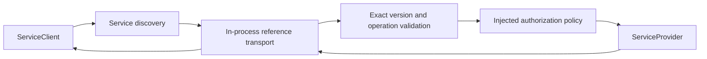

# System service and IPC contract foundation

Workstream: **SVC-IPC-01** (`system-service-ipc` in DF-01)

The `nagi-service-contract` crate defines a host-side client/provider contract
for applications and first-party components that call system services. The
public boundary is transport-neutral and asynchronous-first: providers return
Rust futures, while the reference transport requires no executor or target OS.

## Request path



The in-process transport is a deterministic host-test adapter. The public
request, response, identity, version, and error types do not name or assume
that transport.

## Identity and versioning

- `ServiceId` is a validated lowercase dotted logical name such as
  `filesystem`, `network.socket`, or `example.echo`. Slash, backslash, empty
  segments, uppercase characters, and path-like forms are rejected.
- `OperationId` is a validated lowercase operation name such as `read` or
  `volume_get`.
- `ContractVersion` is an explicit `(major, minor)` pair. Resolution is exact:
  a provider must advertise the requested pair. There is no implicit minor
  compatibility or negotiation. A mismatch returns
  `unsupported_contract_version` with the requested and supported versions.
- Service contract version, NIPC protocol version, and SDK contract version
  are separate values. An adapter must not substitute one for another.

Each registration has a generation-bearing handle. Duplicate service IDs are
rejected; unregistering an old handle cannot remove a later provider registered
under the same ID. Registry instances are independent and safe to share across
threads. The provider is cloned out of the registry before its future is
awaited, so registry locks are not held during provider work.

## Request and response

`RequestEnvelope` carries a nonzero request ID, optional correlation and trace
IDs, service ID, contract version, operation ID, and opaque payload bytes.
Request payloads are bounded at 1 MiB. Responses repeat request/correlation/
trace identity and service/operation metadata and contain either a payload up
to 1 MiB or a structured `IpcError`; an oversized provider response becomes
`response_too_large`.

Identifiers are supplied by the caller; the crate has no global ID generator.
Caller principal is deliberately absent from `RequestEnvelope`. Each trusted
transport establishes it from the authenticated execution context and supplies
it to authorization and provider context. `InProcessReferenceTransport` takes
an `authenticated_caller` when trusted host test code constructs the adapter;
production adapters must derive this value from the OS-owned IPC endpoint or
equivalent runtime context, never from request payload bytes. This crate does
not authenticate process identity by itself.

Payload bytes do not define a serialization format. The reference transport
passes them unchanged. A later target transport must use the repository's
versioned Nagi IDL/binary conventions and reject malformed or oversized
messages; this crate does not use JSON as system IPC wire data.

## Provider, client, discovery, and availability

A provider publishes a `ServiceDescriptor` listing contract versions and
operations. An operation may name an optional typed `CapabilityId`. Providers
return bytes or a `ProviderError` category; there is no free-form provider
message in the default error contract. Availability is reported as available,
busy, or unavailable and maps to structured call errors.

`ServiceClient` resolves a descriptor and calls a `ServiceTransport`. The
transport is replaceable. `InProcessReferenceTransport` implements discovery,
registration lookup, authorization, and provider dispatch for host tests and
early previews.

## Error model

Callers should branch on `IpcErrorCode`, never on display prose. Codes include:

- `service_not_found` and `unsupported_contract_version`;
- `operation_not_found` and `invalid_request`;
- `permission_denied`;
- `unavailable` and `busy`;
- `cancelled` and `deadline_exceeded`;
- `provider_failure`, `response_too_large`, `serialization_failure`, and
  `transport_failure`;
- `duplicate_registration` and `stale_registration`.

Provider failures map to bounded categories without exposing implementation
messages, stack traces, filesystem paths, or credentials. Deadline is a
reserved structured error category; this foundation does not schedule or
interpret deadlines.

## Authorization boundary

Before invoking a provider, the transport supplies the caller principal,
service ID, contract version, operation ID, request/correlation IDs, and the
operation's optional capability requirement to an injected
`AuthorizationPolicy`. A denial maps to `permission_denied`, and the provider
is not called. `DenyAllAuthorization` is the fail-closed policy implementation
provided for callers without an adapter.

The crate re-exports only the capability contract's `PrincipalId` and
`CapabilityId` types for authenticated caller context and operation
requirements. It does not evaluate grants, select resource scopes, store
policy, show prompts, or implement permission UX. The integration owner
must adapt this context to `CapabilityEnforcer` and preserve default-deny
behavior. Services with resource-dependent scope must validate their typed
request and enforce that scope before the side effect; an operation-level hook
alone does not claim fine-grained enforcement.

## Cancellation

`CancellationToken` is clonable and shared. The reference transport checks it
before dispatch, before provider invocation, and after provider completion;
providers also receive it in `CallContext` and must check it at safe points.
Cancellation is cooperative. It cannot interrupt a provider that ignores the
token and cannot undo a side effect already performed. This crate does not
select an async runtime or a deadline clock.

## Existing Nagi boundaries

This contract does not replace or modify:

- the kernel's bounded Channel primitive, which remains low-level IPC;
- `user/libnagi`'s M6 target `ServiceRegistry` and `Supervisor`;
- the App SDK's NIPC v1 envelope and codec;
- the Capability / Permission policy evaluator.

The reference registry is explicitly a host contract-test adapter, not a
second target supervisor or permanent kernel architecture. A future adapter
must map these typed service calls to the existing runtime registry and NIPC
carrier without changing their version meanings. Kernel Channel remains local
IPC and does not become transparent network RPC.

### Deferred M6/NIPC compatibility acceptance

No lossless M6/NIPC adapter mapping is claimed by this foundation. The
integration checkpoint must define and test all of these before target
consumers adopt the crate:

- M6 `ServiceId` stores a byte name of at most 32 bytes and one `u16` version;
  this contract permits a dotted name up to 128 bytes and a `(major, minor)`
  version. The adapter must reject an overlong name and must not truncate a
  name or silently discard a nonzero minor version. A version mapping or a
  target contract change needs an explicit compatibility decision and tests.
- NIPC v1 `source`/`destination` are numeric `AppId`s, while this contract's
  service and operation IDs are logical strings. The integration must bind
  service registration to a destination `AppId` and define how the operation
  is represented in the NIPC message/payload type; NIPC `protocol_version`
  remains distinct from `ContractVersion`.
- Preserve `RequestId` in NIPC's optional request ID and preserve a supplied
  correlation ID. Since NIPC requires a correlation ID where this contract
  allows it to be absent, the adapter must define deterministic synthesis or
  reject that call shape. Derive `PrincipalId` from the authenticated NIPC
  source/runtime registry, never from application-controlled payload data.

The deferred compatibility acceptance is a paired adapter test proving
round-trip service/operation/version and request/correlation identity, explicit
rejection of unmappable values, and authenticated caller derivation. It is
owned by the later integration checkpoint, not by this host-only workstream.

## Example: echo@1 service

Run the complete provider/client example:

```sh
cargo run --manifest-path crates/nagi-service-contract/Cargo.toml --example in_process_echo --locked
```

The example registers `example.echo@1.0`, resolves it through the client,
authorizes one named example caller, and returns the payload byte-for-byte.
It is demonstration code and does not install a production authorization
policy.

## Later integration work

The Integration Owner should review the attached
`NagiOS_0.2_System_Service_IPC_Contract_Foundation_Workstream.md`, then:

1. Register `system-service-ipc` in `.dev/workstreams.json` using the included
   registration proposal. No state schema change is required.
2. Add `nagi-service-contract` to the root Cargo workspace and reconcile the
   shared `Cargo.lock` only at the approved integration checkpoint.
3. Design the adapter to the M6 user-space registry and NIPC v1 envelope;
   retain exact contract-version semantics and add consumer compatibility
   tests.
4. Connect the authorization hook to the existing capability evaluator only
   after the 0.1 M30 PASS and explicit 0.2 integration gate. Add service-level
   tests proving denied calls do not reach side-effecting backends.
5. Define target transport and NIDL binary encoding separately, with malformed
   input, version, cancellation, and authority-boundary tests.

No product or target runtime integration is claimed by this host-side work.
