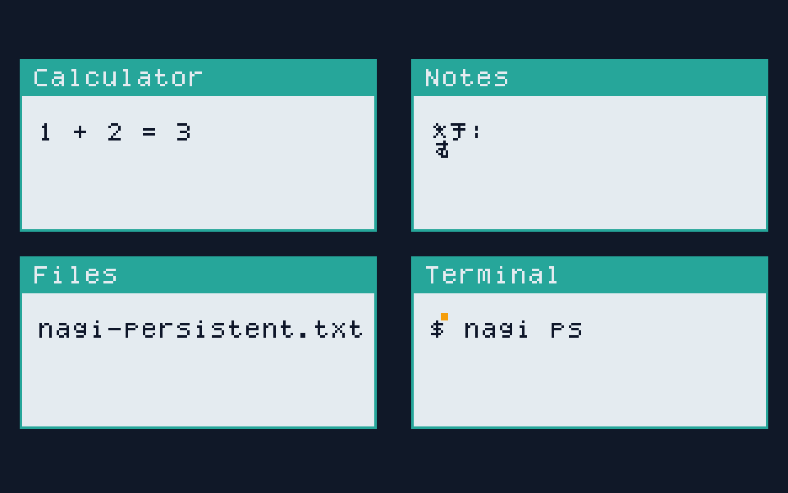
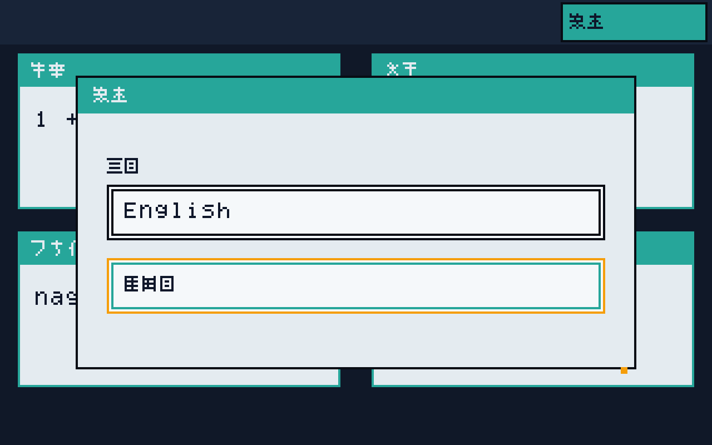
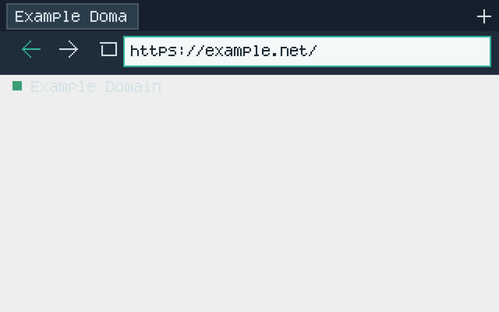

# Nagi OS M29 — Developer Preview Polish Workstream

## Current state: PARTIAL

This checkpoint improves onboarding and SDK documentation and audits the
preview-facing surfaces named in the M29 specification. It does not claim a
finished consumer onboarding flow or complete product UX.

## Audit

| Surface | Current evidence | M29 result / remaining work |
| --- | --- | --- |
| First boot and onboarding | `./nagi image` and `./nagi run` create and boot the QEMU reference image; the implementation status records QEMU acceptance by milestone. | The Japanese guide documents the host and first QEMU workflow. No first-run setup wizard, physical installer, or onboarding screenshots are present. |
| Desktop, defaults, and Settings | `user/nagi-init/src/desktop.rs` draws four M10 acceptance panels and a Settings overlay with an `en-US` / `ja-JP` System language selector. It stores the strict language code in the User Data VFS file `system-language` and loads it before the first Desktop frame. `./nagi m29` verifies the selection after a guest restart. | This is a narrow Desktop acceptance surface, not a complete app launcher, default-app selector, persistent settings service, or integrated system settings experience. Other processes do not yet receive the selected language. |
| Errors and missing providers | CLI commands expose host diagnostics and per-acceptance serial logs; M20–M26 workstreams record typed provider boundaries and unavailable paths. | The guide separates host failures from guest providers and says when a capability is not available. There is no shared end-user error center or provider-management UI. |
| Recovery and update | M16 verifies a sample package install/list/info/launch/atomic-update/remove fixture. M27 QEMU acceptance covers GPT-backed A/B trial rollback/promotion and a read-only Recovery path, including recovery with a pending journal. | Documentation distinguishes the M16 fixture from M27 guest recovery. Authenticated slot manifests, GPT-integrated update installation, account-login readiness, and a user-facing recovery flow remain. |
| Language and accessibility | `user/nagi-localization` supplies embedded UTF-8 `en-US` and `ja-JP` resources, canonical locale parsing, stable-key lookup, English fallback, and safe unknown-key text. The M29 Settings overlay changes four Desktop panel titles and its own labels; the selected System language is persisted in User Data and restored before Desktop rendering. Settings is reachable by Tab and operated with arrows, Enter/Space, and Escape, with a visible focus indicator. | Cross-process propagation, complete first-party translations, a system-wide focus model, an accessibility tree, and assistive-technology acceptance remain unverified. Region/locale, input language/keyboard, and Albert conversation language remain separate concepts. |
| Diagnostics and debug output | `./nagi doctor` is host diagnostics; it recognizes `python3` as well as the `python` and Windows launcher names. Milestone commands save guest serial logs. The M17 acceptance requires bounded startup trace markers, and `m17_trace_excerpt` elides middle lines past its configured cap. | The guide documents log paths and marker-based evidence. The Python 3 alias regression is covered by an integration test, and the current macOS host reports 12/12 checks passing. M17 traces were retained because they support and are consumed by startup acceptance; no indiscriminate trace deletion was made. A `nagi diagnose bundle` command is absent. |
| Developer and SDK docs | Root README, Japanese Developer Preview guide, SDK README, contribution guide, and roadmap now cross-link the verified command surface and known limitations. The SDK README describes the IDL-backed Rust/C APIs and the Hello Nagi sample package flow. | Documentation is present. The SDK remains an early surface; no general app lifecycle, IPC, or capability API is claimed. |
| Package metadata and notices | `nagi.toml` records version `0.1.0-dev` and the QEMU reference machine. `THIRD_PARTY_NOTICES.md` now covers all 18 `sources.lock` components, their exact version/revision/toolchain pins, declared license expressions, and unresolved binary redistribution reviews. A `nagi-cli` regression checks that new pins are added to the notice inventory. `cargo metadata --locked` reports license expressions for all 673 external Cargo packages (41 distinct expressions), including dev and target-specific packages. | The guides link the notices and avoid assigning a project license. Cargo metadata is not a license-text or redistribution review or an image bill of materials. Nagi's license is still undecided; Rust std, Mesa component notices, transitive native sources, and asset provenance need human review before binary redistribution. |
| Screenshots and performance | `docs/assets/screenshots/nagi-m10-qemu-desktop.png` is the M10 QEMU desktop after keyboard/mouse acceptance; `nagi-m18-qemu-browser.png` shows Albert after three verified HTTPS pages; `nagi-m29-settings-ja-jp.png` shows the guest Settings surface after Japanese selection. Three repeated persistent-data M10 QEMU boots on macOS aarch64 reached READY in 2,466–2,568 ms (median 2,486 ms), measured from QEMU spawn to host receipt of the marker. | These are acceptance surfaces, not finished product UIs. The timing includes QEMU/UEFI startup and serial delivery; it is not a clean-install or cross-host performance benchmark. |
| Clean build | CI checks build from fresh checkouts. This local documentation checkpoint did not run `./nagi clean`, which removes `target/` and `out/` including preserved acceptance logs and persistent disks. | Existing evidence remains preserved. A clean release build and artifact reproducibility are part of the M30 release gate. |

## Captured M10 acceptance surface

This is a real guest display captured after M10 QEMU input acceptance. It
documents the current fixed four-panel surface and does not imply a complete
desktop shell or complete Japanese localization.

## Captured M29 Settings language selection

`./nagi m29` replays the existing M10 panel interactions, moves the pointer
away from Settings, then uses Tab, Enter, Escape, Enter, Down, Up, Down, and
Space to open Settings and select Japanese. The guest reports both the
`ja-JP` selection and the M29
acceptance marker before the runner saves this QEMU display. The same
acceptance then restarts QEMU with the same writable User Data disk and checks
that `ja-JP` was restored before the Desktop's first frame. The screenshot
shows the keyboard focus ring on the selected Japanese option, the Settings
labels, and translated panel titles from the first accepted boot.

## Captured M18 Albert browser acceptance

The M18 acceptance runner now captures QEMU's display over QMP after the
guest reports all three HTTPS pages rendered. The saved image is from the
last accepted page (`example.net`) and shows Albert's tab, navigation controls,
address bar, and rendered Example Domain content. It is an acceptance snapshot,
not a claim that browser UX or localization is complete.

## Verification

- The POSIX root launcher now prefers Cargo beside the discovered rustup
  executable and prepends that directory so Cargo also resolves its matching
  rustc shim. This avoids an x86_64 Homebrew Cargo/rustc pair shadowing the
  repository-pinned ARM64 nightly on this macOS host. The M0 acceptance uses
  fake PATH entries to verify both shim selection and the rustc lookup.
- `./nagi --help` printed the supported command list and `./nagi doctor`
  reported 12/12 checks with the original PATH. The complete
  `sh tests/acceptance/m0_launcher.sh` acceptance also passed, including its
  image build.
- A local Markdown-link audit checked 47 relative links across the root
  README, contribution guide, roadmap, Developer Preview guide, SDK README,
  and this workstream; all resolve.
- `cargo test --locked --offline -p nagi-cli --lib third_party_notices::third_party_notices_cover_every_pinned_component_and_declared_license`
  — passed; every source-lock component, version/revision/toolchain pin, and
  declared license expression is represented in `THIRD_PARTY_NOTICES.md`.
- `python3 tools/audit_cargo_license_metadata.py` — passed for all 673 external
  locked packages; zero packages lacked a declared license expression. The
  graph includes dev and target-specific dependencies and is not an image bill
  of materials. This is metadata coverage, not license-text or redistribution
  approval.
- `doctor_recognizes_python3_without_a_python_alias` — passed after confirming
  it failed against the prior candidate list; `./nagi doctor` then passed on
  macOS with 12 checks, including `/opt/homebrew/bin/python3`.
- `cargo test --locked --offline -p nagi-cli --all-targets` — passed (135 unit
  tests, 21 integration tests); `cargo clippy --locked --offline -p nagi-cli
  --all-targets -- -D warnings` — passed.
- `cargo test --locked --offline -p nagi-localization -p nagi-cli --lib` —
  passed (5 localization tests and 147 CLI tests); focused warnings-denied
  Clippy for both packages passed.
- The M29 desktop target compiled with
  `m10-desktop,m29-settings-acceptance`; an earlier `./nagi m29` passed after
  selecting `ja-JP` in the guest, preserving all M10 focus/input markers. Its
  QEMU log and raw screenshot are under
  `out/evidence/m29-settings-1790812427414735000/`.
- `./nagi desktop` passed after the Settings UI was added, preserving the M10
  Calculator, Notes, Files, Terminal, and Japanese input acceptance path.
- `./nagi m27` and `./nagi m30` also passed after the change. M27 exercised
  three-trial rollback, healthy-slot promotion, Recovery, and grouped Undo;
  M30 booted the unchanged 64 GiB reference qcow2 twice and passed its separate
  M20 Model Store reader fixture. Their detailed evidence is recorded in the
  corresponding M27/M30 workstreams.
- `rustfmt --check` for the changed Rust files and `git diff --check` — passed.
- `./nagi desktop` — passed on 2026-09-30 after the scanout and bitmap-font
  changes; the guest reported READY, four app-focus markers, Japanese input,
  and `Nagi M10 acceptance PASS`. QEMU QMP saved the guest display as a
  1280×800 PNG. Its SHA-256 is
  `061c02741343026c2b6974ae846fbbf26bde48b8e00d0160abe918da2744932e`.
- Three real `./nagi desktop` runs passed with the same guest
  acceptance markers. Host times from QEMU child spawn to receipt of
  `Nagi M10 desktop READY` were 2,486 ms, 2,466 ms, and 2,568 ms (median
  2,486 ms). Each run's image, OVMF vars, serial logs, persistent-data snapshot,
  and measurement are preserved under
  `out/evidence/m29-desktop-timing-sample-{1,2,3}/`.
- The kernel scanout geometry test is configured in Ubuntu-host CI because the
  local macOS host is AArch64 and cannot compile the kernel's x86 inline
  assembly as a native host test. The real x86-64 guest acceptance above
  exercises the 1280×800 full-scanout path.

## POSIX launcher toolchain selection — 2026-10-01

The standard launcher initially selected `/usr/local/bin/cargo` from PATH,
which attempted to link the CLI for x86_64 on an ARM64-only Command Line Tools
installation. Selecting only the rustup Cargo proxy still allowed Cargo to
find the Homebrew rustc by name. The launcher now selects Cargo next to rustup
and places that shim directory first in PATH, keeping Cargo and rustc on the
same pinned host toolchain. The mocked M0 regression failed before the fix and
passed after it; the full M0 launcher/image acceptance, `./nagi doctor`
(12/12), and `./nagi --help` passed after the change.

## ARM64 host workspace checks — 2026-10-01

The root `build`, `test`, and `lint` commands previously selected every
workspace package except the kernel. On an ARM64 host that also compiled
`libnagi`'s x86_64 syscall-register stubs and target-only service packages as
host code. The CLI now keeps the full host workspace selection on x86_64 and
selects an explicit set of host-compatible packages on other architectures.
The regression checks the unchanged x86_64 arguments and the ARM64 package
set, including its warning-denied Clippy boundary.

On this ARM64 macOS host, `./nagi test`, `./nagi build`, and `./nagi lint` all
passed. The CLI suite passed with 135 unit and 21 integration tests, and the
changed CLI package passed `cargo fmt --manifest-path
tools/nagi-cli/Cargo.toml -- --check`. `./nagi fmt` now matches the CI source
selection and passes without checking or reformatting the vendored Servo tree.

## QEMU timeout diagnostics — 2026-10-01

Headless and GUI/VNC QEMU marker waits now attempt one bounded `query-status`
and CPU-register request after an acceptance timeout, then append returned
data, query errors, or a skipped request to the serial log. QMP response lines
are capped at 64 KiB and the combined query budget is three seconds. Four CLI tests cover the
queries, serial-log append, and line bound. The focused suite passed 138 unit
tests and 21 integration tests; `./nagi test`, `./nagi lint`, `./nagi build`,
and `./nagi fmt` passed. A fresh M28 one-repetition QEMU run also passed M19,
M22, and M27 after a prior M27 Recovery timeout. That timeout remains
unexplained; the successful rerun did not exercise the diagnostic-on-timeout
path.

The QMP timeout request now also asks the HMP monitor for `x/12i $rip`, adding
a bounded instruction window to the same three-second total budget. The QMP
fixture test now validates the additional request. A live QEMU/QMP smoke
returned the bounded disassembly and is preserved at
`out/evidence/m28-run-20260930T211250Z-51667/qmp-instruction-smoke.log`.
`./nagi test`, lint, formatting, and build pass with the change. The successful
two-repetition M28 gate did not time out, so the additional diagnostic has not
yet been observed on an actual firmware hang.

## Remaining M29 work

1. Capture additional genuine QEMU screenshots as more preview UI surfaces
   are implemented; the current tracked images cover M10 desktop and M18
   Albert browser acceptance.
2. Complete a first-run flow, end-user provider/error presentation, Settings,
   accessibility, and localization work in their owning milestones.
3. Measure clean-install boot and broader clean-checkout/release reproducibility;
   the current three-run sample covers persistent-data QEMU boots on one host.
4. Resolve project and third-party redistribution notices before a binary
   Developer Preview is distributed.

These open items keep M29 `PARTIAL` and are not release-ready claims.

## System language persistence — 2026-10-01

The Settings selector now writes only the canonical `en-US` or `ja-JP` value
to `system-language` on the existing User Data VFS capability. Desktop applies
the selection only after the VFS write and flush succeed. Startup reads the
bounded value before its first Desktop frame; missing, malformed, or
unsupported values safely use English, and storage errors are reported.

The M29 runner now gives each acceptance a unique image, User Data disk, OVMF
variables file, and logs so an older saved language cannot turn a clean first
run into a warm-start test and previous outputs remain intact. A repeat using
the first run's fixed-name disk stopped during QMP input with `VM not running`
before any panel interaction marker. The subsequent run-scoped acceptance
passed all three boots: its bootstrap boot formatted and wrote User Data, the
GUI boot passed the existing M10 panel/input markers and recorded
`Nagi M29 settings locale persisted PASS locale=ja-JP`, and a second QEMU boot
with the same User Data disk passed
`Nagi M29 settings preference restored PASS locale=ja-JP` after
`Nagi M10 desktop READY`.

Run ID `1790816404401513000` is recorded in
`out/evidence/m29-settings-1790816404401513000/README.md` and verified by its
`SHA256SUMS`. The accepted screenshot is
`out/evidence/m29-settings-1790816404401513000/nagi-m29-settings-ja-jp.png`
(SHA-256
`974ab722fdc40b855ed97d9ab92c2c69f800c373544fbc7825b2146ef5fbd3cc`), byte-
identical to the tracked screenshot. The generated boot image SHA-256 is
`bb9c1222aabdb52ac1c0326694d70e80730cedd15acce885cb084027194bc406`; the
User Data disk SHA-256 is
`9185b2ed3a312c3c01bb26a67f3f79b456a4b020cdfe3bd8fb8c127eb5282e16`. The
per-run bootstrap, GUI, and restart logs are under `out/logs/` with the same
run ID. This proves persistence for the fixed Desktop acceptance path; it
does not establish a settings service or propagation to other processes.

After the change, `./nagi fmt`, `./nagi test`, `./nagi lint`, and
`./nagi build` passed; `cargo test --locked --offline -p nagi-cli --all-targets`
passed 151 unit and 21 integration tests. The M27 GPT A/B/Recovery/Undo
regression passed at `out/evidence/m27-ab-rollback-1790816764088451000/`, and
the M30 reference-disk plus M20 FAT32-reader regression passed at
`out/evidence/m30-release-1790817095155131000/`. Existing vendored-libc
`target_os="nagi"` warnings and the host's unavailable QEMU audio input were
reported; they did not fail these checks and do not establish host audio I/O.

## M18 QEMU browser screenshot — 2026-10-01

`./nagi m18` passed after the M18 target build and real QEMU boot. The guest
verified TLS, presented browser chrome, and rendered pages for `example.com`,
`example.org`, and `example.net`, then reported
`Nagi M18 browser scenario complete pages=3`. QMP captured the accepted
1280×800 display as `docs/assets/screenshots/nagi-m18-qemu-browser.png`
(SHA-256
`ede8a7967a1634c393aa53252749af22d8d98aa91e4d4711402de0e860c7e097`). The
original is preserved at
`out/evidence/m29-browser-1790798334374076000/nagi-m18-browser.png`; the
serial log is `out/logs/m18-albert.log`. This QEMU build emitted a host
audio-backend diagnostic (`virtio-sound.in` unavailable), but browser
acceptance exited 0. Host audio playback is not covered by this run. This
evidence adds a browser acceptance surface; M29 remains `PARTIAL`.

## Windows CRLF localization fix and persistence rerun — 2026-10-01

Windows CI run `36800687313` on baseline commit `d0ff15c` found that
`lookup_resource` retained the carriage return from CRLF catalog lines; the
Japanese resource test received `"設定\r"` instead of `"設定"`. A regression
test with a CRLF resource reproduced the failure. The parser now strips one
terminal `\r` from each line before interpreting its key and value.

After the change, all six `nagi-localization` host tests pass. The CLI suite
passes 151 unit and 21 integration tests, and formatting, repository tests,
lint, build, and the Nagi-target `nagi-localization` compile pass. The baseline
run's Windows test failed on the CRLF value and its Ubuntu-host job passed. The
push of the fix commit cancelled the unfinished Nagi-target job on that old
run; this cancellation is not a product failure. New CI run `36802487593` on
`e2b9d48ac9333489d392b1a024c6eee155aa6ea1` passed all three jobs. Its target
job passed user-init and UEFI builds and M17 first-web-pixel, M18 chrome and
three-site HTTPS, M19 Search, M22 grouped Undo, M27 rollback/Recovery, M29
language persistence, and M30 release-disk acceptance.

`./nagi m29` passed again with the CRLF fix present. Run ID
`1790818615588652000` passed the User Data bootstrap, Japanese Settings
selection with the M10 focus/input markers, and a restart using the same User
Data disk that restored `ja-JP`. Guest READY arrived after 2,448 ms. The
screenshot is SHA-256
`974ab722fdc40b855ed97d9ab92c2c69f800c373544fbc7825b2146ef5fbd3cc`,
byte-identical to `docs/assets/screenshots/nagi-m29-settings-ja-jp.png`.
`out/evidence/m29-settings-1790818615588652000/README.md` and its seven-entry
`SHA256SUMS` cover the screenshot, QEMU image, OVMF variables, User Data disk,
and all three serial logs; all entries verify. This proves the fixed Desktop
acceptance path only. Cross-process language propagation, complete
localization/accessibility, onboarding, and user-facing provider/recovery
polish remain open; M29 remains `PARTIAL`.

## Settings keyboard navigation — 2026-10-01

The Settings language selector now supports Tab focus on its button while
closed and cycling between locale options while open, Up/Down movement,
Enter/Space activation, and Escape to close. The focused control has a visible amber outline, while the selected locale retains its teal selection outline. This is
limited to this overlay and does not add a system-wide focus model or an
accessibility tree. Mouse input remains supported, and locale persistence still
completes before the selected locale is applied.

The M29 source contract regression first failed against the old mouse-only
implementation because the keyboard key constants were absent; after the
implementation, `m29_language_setting_is_reachable_and_selectable_by_keyboard`
and `system_language_is_committed_to_user_data_before_desktop_selection` pass.
`cargo test --locked --offline -p nagi-cli --all-targets` passes 152 unit and
21 integration tests. The Nagi no-std target compile passes for
`m10-desktop,m29-settings-acceptance`.

An initial QEMU attempt (`1790849842483344000`) sent a pointer-motion event
after the final keyboard activation. The guest had already reached its
acceptance marker and stopped polling input, so QMP reported `VM not running`;
that attempt is retained as a failed run and is not counted as acceptance. The
runner now moves the pointer before keyboard activation and sends no QMP input
after the final selection. The fresh run `1790850015194700000` passed the
keyboard selection marker, User Data persistence, restart restoration, and all
existing M10 desktop interaction markers; guest READY arrived in 2,425 ms.
Its accepted screenshot SHA-256 is
`8822118a65187b7e29afcba781c3a659e043263f00a7f823ef1c94aae17d323d`. The
9-entry evidence manifest verifies the three serial logs, boot image, User
Data disk, OVMF variables, both screenshots, and README under
`out/evidence/m29-settings-1790850015194700000/`. The same accepted screenshot
is tracked at `docs/assets/screenshots/nagi-m29-settings-ja-jp.png`.

`./nagi m29` passed the full guest acceptance. M29 remains `PARTIAL` because
the rest of the Desktop has no keyboard focus support or accessibility tree,
and cross-process language propagation, complete localization, onboarding,
and remaining release-polish work are incomplete.

The broader key sequence first failed in run `1790850731550869000`: Up from
Japanese left focus on Japanese, then Down moved it to English, and Space
persisted `en-US` while the runner waited for the `ja-JP` marker. The focus
transition was corrected so either Up or Down moves to the other locale option.
Fresh run `1790850851718829000` then passed the full Tab/Enter/Escape/arrow/
Space sequence, M10 acceptance, and same-disk `ja-JP` restoration; READY arrived
after 2,407 ms. Its nine-entry SHA-256 manifest verifies in
`out/evidence/m29-settings-1790850851718829000/`, including both successful
boot logs, the persisted User Data disk, and the accepted screenshot. This
acceptance path exercised Escape, Up, and Space in addition to the original
Tab/Enter/Down selection route.
